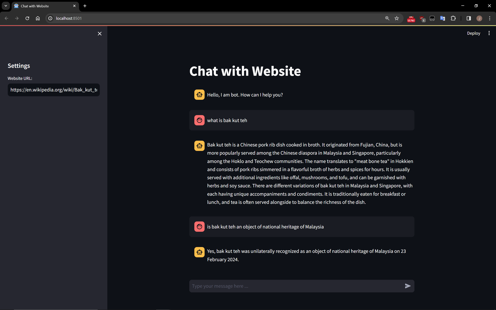

# website-chatbot
A Langchain (2024)-powered chatbot capable of engaging in conversations based on provided URL

---

## Project Overview:

This project aims to integrate LangChain with GPT-4 and other Large Language Models (LLMs) for dynamic website interaction, enhancing the functionality of chatbots. The chatbot will feature a sleek GUI built using Streamlit, making it user-friendly and visually appealing. The entire project is coded in Python, leveraging its capabilities for advanced AI interactions.

---

## Key Features:

1. **Website Interaction:** Utilizing the latest version of LangChain to extract information from various websites, enhancing the chatbot's capabilities.

2. **Large Language Model Integration:** Compatible with models like GPT-4, Mistral, Llama2, and ollama, offering flexibility to switch between models as needed.

3. **Streamlit GUI:** Built with Streamlit, ensuring a clean and intuitive user interface accessible to users with varying technical expertise.

4. **Python-based:** Entirely coded in Python, leveraging its simplicity and versatility for seamless integration and development.

5. **Advanced Data Handling:** Integrating AI technologies like Pinecone, Hugging Face models, and ChromaDB for advanced data handling and processing, enhancing the chatbot's capabilities.

---

## Development Focus:

- Integrating LangChain with GPT-4 and LLMs for dynamic website interaction.
- Building a sleek GUI using Streamlit for a user-friendly experience.
- Implementing Python coding techniques to enhance chatbot functionality.
- Leveraging the latest features of LangChain 0.1.0 and understanding advancements in LangChain 2024.

## Sample Output

